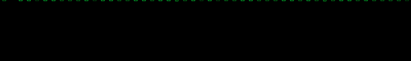

<div align="center">




</div>

---

<div align="center">

```
┌─────────────────────────────────────────────────────────────────────────┐
│  > Tech enthusiast building things that scale                           │
│  > 12 years across Amazon · Microsoft · McAfee                         │
│  > From XDR threat correlation to LLM inference pipelines              │
│  > Currently hacking away in Berlin 🏗️                                 │
└─────────────────────────────────────────────────────────────────────────┘
```

</div>

---

## ⚡ What I work on

```rust
fn me() -> Enthusiast {
    Enthusiast {
        focus:    vec!["LLM Tooling", "Distributed Systems", "Creative Coding"],
        security: vec!["XDR", "Threat Correlation", "Malware Analysis"],
        building: vec!["AI-native products", "Agent architectures", "Local LLM tooling"],
        location: "Berlin, DE 🇩🇪",
    }
}
```

---

## 🛠 Tech Stack

<div align="center">

**Languages**


**AI / ML**


**Infrastructure**


</div>

---





## 🚀 What I'm Building

---

### 🛡️ DeepSOC — Multi-Agent Security Operations Centre `🔒 private`

> *A swarm of specialised AI agents that autonomously investigate security incidents — from raw threat signal to incident report — without human intervention.*


Multi-agent system where each agent has a distinct role, memory, toolset, and LLM — coordinated via an event-sourced Akka Typed actor hierarchy. Built on top of Anthropic and OpenAI APIs with a model-agnostic provider abstraction.

---

### 🛠️ ForgeFlow — Local-First Multi-Agent Orchestration Studio

> Visual workflow builder for designing, testing, and running multi-agent pipelines against live LLM providers — entirely on your machine.


&nbsp;[→ View repo](https://github.com/5aikat213/ForgeFlow)

React studio + FastAPI runtime for orchestrating multi-agent workflows visually. Supports 14+ providers (Anthropic, OpenAI, Bedrock, Gemini, Mistral, Ollama and more), MCP server integration, versioned workflow assets, and live run inspection — all bound to localhost by default with encrypted credential storage.

---

### 🦀 localllm-rust-tool-calling

> Rust chat server with function calling against a local LLM — `/chat` and `/search` endpoints, zero cloud dependency.


&nbsp;[→ View repo](https://github.com/5aikat213/localllm-rust-tool-calling)

---

### ⚡ zio-ollama-tool-calling

> Scala/ZIO client for Ollama with tool calling — web search, webpage extraction, and Python code execution as LLM tools. Streaming supported.


&nbsp;[→ View repo](https://github.com/5aikat213/zio-ollama-tool-calling)

---

## 📊 Stats

<div align="center">


</div>

<div align="center">


</div>

---

## 🌐 Connect

<div align="center">

[](https://twitter.com/_saikat_)
[](mailto:trulysaikat@gmail.com)
[](https://github.com/5aikat213)

</div>

---

<div align="center">


</div>
