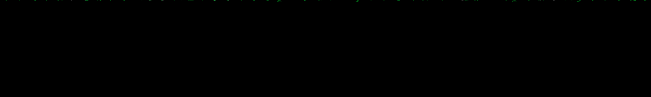

<!--
Update guide: keep four projects in Featured Builds. Move older work into
More Systems or Earlier Experiments instead of expanding the main section.
-->

<div align="center">




</div>

---

<div align="center">

```text
┌─────────────────────────────────────────────────────────────────────────┐
│  > Senior software engineer building intelligent systems at scale       │
│  > 12+ years across Amazon · Microsoft · McAfee                        │
│  > From XDR threat correlation to production multi-agent platforms     │
│  > Still hacking away in Berlin 🏗️                                    │
└─────────────────────────────────────────────────────────────────────────┘
```

</div>

---

## ⚡ What I work on

```rust
fn me() -> Engineer {
    Engineer {
        focus:    vec!["Agentic AI", "Distributed Systems", "Developer Infrastructure"],
        security: vec!["XDR", "Threat Detection", "Zero-Trust Agent Tooling"],
        building: vec!["AI-native products", "Local-first software", "MCP infrastructure"],
        location: "Berlin, DE 🇩🇪",
    }
}
```

I build systems where **AI, distributed architecture, and security engineering** meet—professionally at Amazon, Microsoft, and McAfee, and independently through end-to-end products that explore what dependable agentic software can look like.

---

## 🛠 Tech Stack

<div align="center">

**Languages**


**AI / Agents**


**Infrastructure**


</div>

---





<div align="center">


</div>

## 🚀 Featured Builds

---

### 🛡️ AI-XDR — AI-Native Security Operations

> *From raw security telemetry to evidence-backed investigation: agents that assist analysts without bypassing deterministic controls.*


An AI-native SOC/XDR platform combining event-driven ingestion, retrieval and graph context, multi-agent investigation, threat hunting, response workflows, and a React analyst console. The architecture separates probabilistic reasoning from policy, authorization, and auditable execution boundaries.

---

### 🎙️ Saarthi — Local-First macOS Voice Assistant

> *A native assistant that listens, reasons, uses tools, and speaks—while keeping the intelligence on your machine.*


A Rust daemon and native SwiftUI/AppKit client covering the complete voice loop: hotkey activation, VAD, speech recognition, local LLM reasoning and tool execution, speech synthesis, typed events, model downloads, integrity verification, and signed-app delivery.

---

### 🚪 OpenMCPGate — Governed MCP Infrastructure

> *A gateway for exposing agent tools without giving up authentication, policy, data protection, or operational control.*


A split-plane MCP gateway with a Go data plane, TypeScript control plane, React administration UI, and CLI. It explores endpoint authentication, fine-grained policy, DLP, rate limiting, audit trails, and repeatable deployment through Helm and Terraform.

---

### 🛠️ ForgeFlow — Local-First Multi-Agent Orchestration Studio

> *Design, test, and run multi-agent workflows against live model providers—entirely on your machine.*


&nbsp;[→ View repo](https://github.com/5aikat213/ForgeFlow)

React studio + FastAPI runtime for visually building versioned agent workflows. Supports 14+ model providers, MCP server integration, reusable workflow assets, live run inspection, localhost-only defaults, and encrypted credential storage.

---

## 🧭 More Systems

| Project | What it explores | Stack |
|---|---|---|
| **[AgentBus](https://github.com/5aikat213/AgentBus)** | Event-sourced coordination runtime for domain-neutral agent systems | Java 21 |
| **Forge** | Fine-tuning, evaluation, and serving workflows for local models and Amazon SageMaker | Python · LoRA/QLoRA |
| **Go-MatchIt** | AI-assisted process discovery, planning, sandboxed execution, and project coordination | TypeScript · Python |
| **PocketMind** | On-device Android assistant with local language models and tool execution | Kotlin · Android |
| **Luminary** | Browser-native RAW photo editing and GPU-accelerated imaging | Rust · WASM · WebGPU |

<details>
<summary><strong>Earlier experiments</strong></summary>

<br/>

- **DeepSOC** — Earlier multi-agent security investigation architecture built with Scala and Akka Typed.
- **[localllm-rust-tool-calling](https://github.com/5aikat213/localllm-rust-tool-calling)** — Rust chat server with local-LLM function calling and zero cloud dependency.
- **[zio-ollama-tool-calling](https://github.com/5aikat213/zio-ollama-tool-calling)** — Scala/ZIO Ollama client with streaming tool execution.
- **AICineMind** and **FinancialSpiceFlow** — Product experiments built around generative AI workflows.

</details>

---

## 🌐 Connect

<div align="center">

[](https://www.linkedin.com/in/5aikat)
[](https://twitter.com/_saikat_)
[](mailto:trulysaikat@gmail.com)
[](https://github.com/5aikat213)

</div>

---

<div align="center">


</div>
